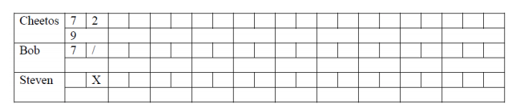
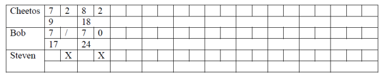

# Assignment 1

## Assignment 1 Prompt:

> Individual Programming Assignment
> ***Due to Sep 16, 4 pm.***
> Write a program (Java or other OO programming languages) that calculates the score of a single bowling game for multiplayer.
>
> Input: Number of players. Name of each player. The sequence of throws.  
> Expected output: The score for players in each frame. Text outputs will be acceptable, GUI output will get extra points.
>
> **Example:**  
> Number of players: 3  
> What is the name of the first player? Cheetos  
> What is the name of the second player? Bob  
> What is the name of the third player? Steven  
>
> **Frame 1**  
> Enter first throw for Cheetos: 7  
> Enter the second throw for Cheetos: 2  
> Enter first throw for Bob: 7  
> Enter the second throw for Bob: 3  
> Enter first throw for Steven: 10  
>
> **Frame 2**  
> Enter first throw for Cheetos: 8  
> Enter the second throw for Cheetos: 2  
> Enter first throw for Bob: 7  
> Enter the second throw for Bob: 0  
> Enter first throw for Steven: 10  
> 
> Submit source codes along with the result screenshots of the following four test cases:
> * Test case 1: all zeros
> * Test case 2: all strikes (perfect game)
> * Test case 3: all spare
> * Test case 4: your own case
> 
>   
>   

## My Solution:

Written in Java, my solution starts by gathering the number and names of players, as per the assignement guidelines, and
then uses that data to build a very hacked-together display of frames for a given bowler.
